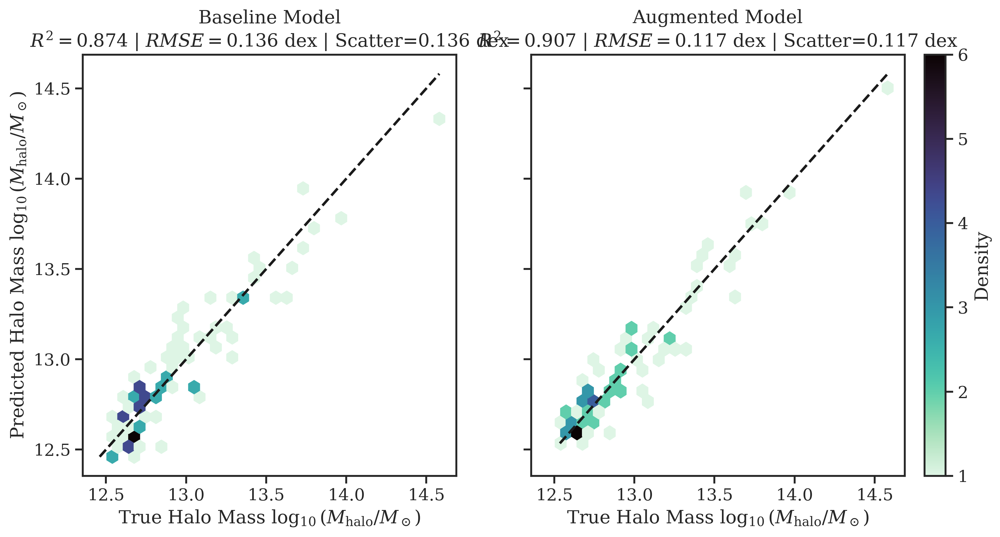
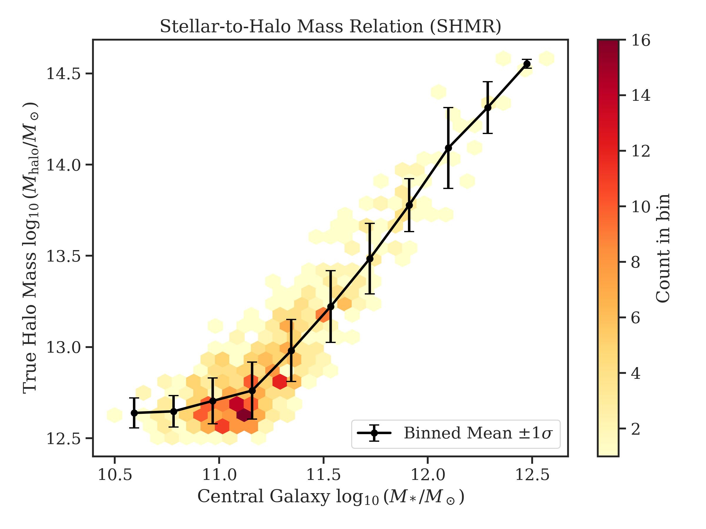
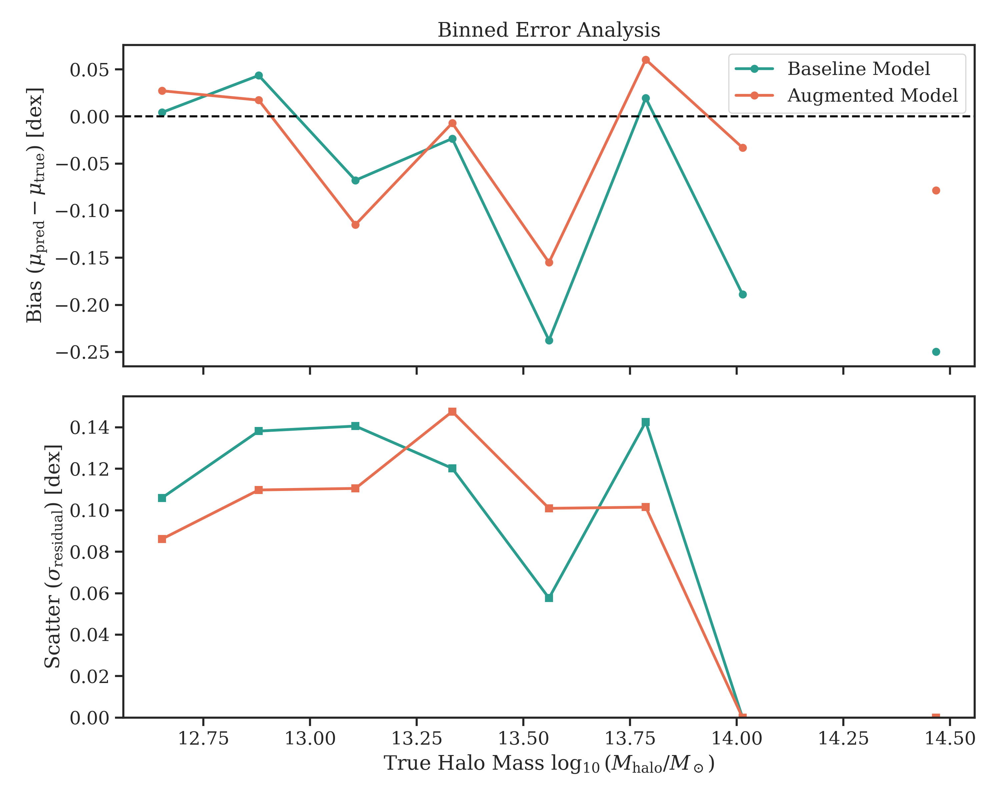
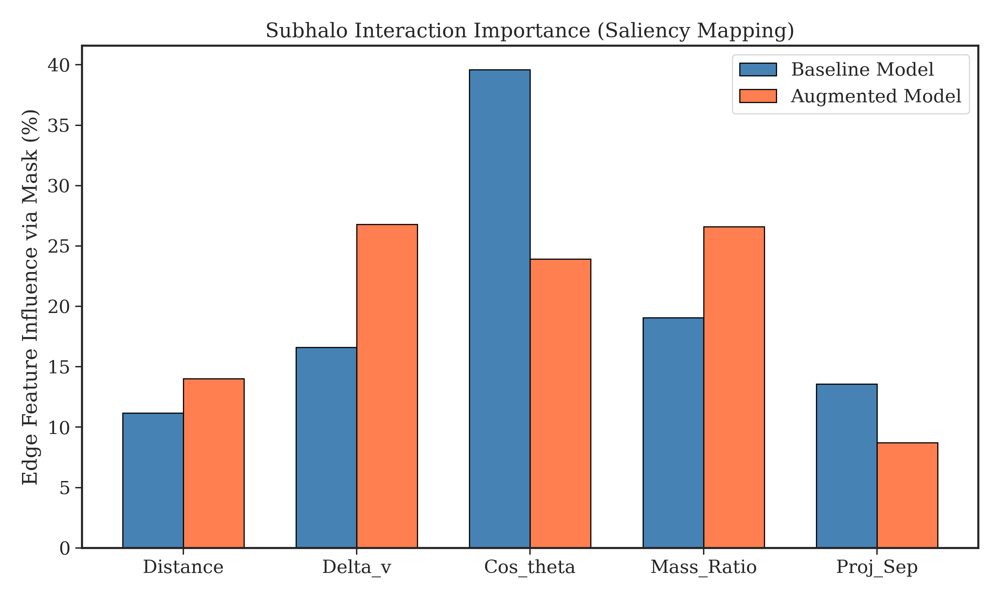

# Cosmic-Net

[](https://www.python.org/downloads/release/python-3100/)
[](https://pytorch.org/)
[](https://opensource.org/licenses/MIT)

**Physics-Informed Graph Neural Network for Dark Matter Halo Mass Prediction**

Cosmic-Net is a research-grade GNN that predicts dark matter halo masses from galaxy/subhalo distributions, then distills the learned representations into human-readable mathematical equations using symbolic regression. Based on [HaloGraphNet](https://arxiv.org/abs/2204.07077) (Villanueva-Domingo et al., 2022).

## Key Features

- **Physics-Informed Loss**: Virial theorem constraint (2·KE + PE ≈ 0) as soft penalty
- **Edge-Conditioned Convolution**: NNConv with 5 physics-motivated edge features
- **Uncertainty Quantification**: MC-Dropout with configurable N samples for confidence intervals
- **Cross-Simulation Generalization**: Train on TNG, test on CAMELS (or any combination)
- **Symbolic Regression**: Distill GNN into interpretable equations via PySR
- **Dimensional Analysis**: Post-filter discovered equations for physical consistency
- **Ablation-Ready**: Every architectural choice is a config flag

## Installation

### Prerequisites

- Python 3.10
- CUDA 11.8+ (for GPU support)
- Conda (recommended)

### Quick Start

```bash
# Clone the repository
git clone https://github.com/Rusheel86/cosmic-net.git
cd cosmic-net

# Create conda environment
conda create -n cosmic-net python=3.10
conda activate cosmic-net

# Install PyTorch (adjust for your CUDA version)
conda install pytorch==2.1.0 torchvision torchaudio pytorch-cuda=11.8 -c pytorch -c nvidia

# Install PyTorch Geometric
pip install torch-geometric==2.4.0
pip install torch-scatter torch-sparse torch-cluster torch-spline-conv -f https://data.pyg.org/whl/torch-2.1.0+cu118.html

# Install remaining dependencies
pip install -r requirements.txt

# Setup environment variables
cp .env.example .env
# Edit .env with your API keys (TNG_API_KEY, WANDB_API_KEY)
```

##  Results & Visualizations

Our Augmented Model significantly improves over the Baseline when generalizing to higher complexities. Below are standard astrophysical evaluations:

### Model Performance: Predictions vs. True Mass


### Stellar-to-Halo Mass Relation (SHMR Dataset Explorer)


### Bias and Scatter Binned Analysis


### Explainable AI (Physics-Informed Saliency Mapping) - Subhalo Kinematics Importance
*Note on XAI Methodology: While structural masking methods like PGExplainer or GNNExplainer are standard for discrete topology tasks (e.g., molecule classification), they artificially break the continuous spatial manifold in astrophysics datasets by simulating 'dropped' edges. We instead utilized **Input × Gradient Saliency Mapping**, a rigorous evaluation of the physics-informed model's smooth sensitivity to continuous kinematic scalars (velocity, mass). This measures impact without violating spatial graph integrity.*

The table and chart below illustrate the internal gradient mapping across physical edge interactions in the local graphs. This reveals exactly which kinematic properties of neighboring subhalos are driving the GNN\'s cluster mass prediction:

*   **Baseline Model** relies disproportionately on geometric alignment (**Cos_theta**, 39.61%) to deduce total mass boundaries—effectively memorizing coordinate shapes rather than internal dynamics.
*   **Augmented Model** distributes feature importance much more robustly across actual physical kinematics, primarily balancing relative velocity interactions (**Delta_V**, 26.78%) and mass differentials (**Mass_Ratio**, 26.59%). This signifies a deeper, generalization-ready understanding of subhalo gravitational dynamics.

| Model     | Distance   | Delta_v   | Cos_theta   | Mass_Ratio   | Proj_Sep   |
|-----------|------------|-----------|-------------|--------------|------------|
| Baseline  | 11.16%     | 16.60%    | 39.61%      | 19.06%       | 13.57%     |
| Augmented | 14.01%     | 26.78%    | 23.91%      | 26.59%       | 8.71%      |




## 🚀 Pre-Trained Model Inference (For Frontends & APIs)


### 1. Required Files for Inference
* `best_model_augmented.pt` (The weights file)
* `model/model.py` (The PyTorch class architecture, e.g., `CosmicNetGNN`)
* `config/config.yaml` (The hyperparameters to initialize the correct model size)

### 2. Node Features (Input Constraints)
Each galaxy/subhalo is a **Node**. The 4 features must be in this exact order and take the form of $\log_{10}$ values:
1. `log_10(stellar_mass)` (in $M_\odot$)
2. `log_10(velocity_dispersion)` (in km/s)
3. `log_10(half_mass_radius)` (in kpc)
4. `log_10(metallicity)`

### 3. Edge Features
Connections between galaxies are formed using a **Radius Graph** (e.g., $2.0$ Mpc). Edges require 5 physical features:
1. `distance` (3D Euclidean distance in Mpc)
2. `delta_v` (Relative velocity magnitude in km/s)
3. `cos_theta` (Cosine of angle between pos and vel vectors)
4. `mass_ratio` (Difference in log stellar masses)
5. `proj_sep` (2D projected separation in Mpc)

### 4. Loading the Model snippet

```python
import torch
import yaml
from model.model import build_model

# 1. Load config
with open("config/config.yaml", "r") as f:
    cfg = yaml.safe_load(f)

# 2. Initialize device and architecture
device = torch.device("cuda" if torch.cuda.is_available() else "cpu")
model = build_model(cfg).to(device)

# 3. Load weights (dict extract mapping)
checkpoint = torch.load("best_model_augmented.pt", map_location=device)
model.load_state_dict(checkpoint["model_state_dict"])
model.eval()

# 4. Predict
# predictions = model(pyg_data_batch)  # Takes in PyG Data/Batch objects
```

## Quick Start


### Training with Synthetic Data

```bash
# Train on synthetic data (default)
python main.py train

# Full pipeline: train -> evaluate -> explain -> symbolic regression
python main.py full
```

### Using Real Simulation Data

```bash
# Edit config/config.yaml to change data source
# data:
#   source: tng  # or camels, camels_hf

# Cross-simulation experiment
# training:
#   train_source: tng
#   test_source: camels
```

### API Server

```bash
# Start the FastAPI server
python main.py serve

# Or directly with uvicorn
uvicorn deploy.api:app --host 0.0.0.0 --port 8000
```

API endpoints:
- `POST /predict` - Predict halo mass with uncertainty
- `POST /explain` - Generate node/edge importance masks
- `GET /health` - Health check

## Data Sources

### Source 0: Synthetic (Default)
Pre-generated mock data for development and testing. Automatically generated if files don't exist.

### Source 1: IllustrisTNG-100
```yaml
# In config.yaml
data:
  source: tng
  tng:
    base_url: https://www.tng-project.org/api/TNG100-1/
    snapshot: 99  # z=0
```
Requires `TNG_API_KEY` in `.env` file. Register at [TNG Project](https://www.tng-project.org/users/register/).

### Source 2: CAMELS (HDF5)
```yaml
data:
  source: camels
  camels:
    suite: IllustrisTNG  # or SIMBA
    simulation: LH_0
```
Direct download from Flatiron Institute, no authentication required.

### Source 3: CAMELS via Hugging Face
```yaml
data:
  source: camels_hf
  camels_hf:
    dataset_name: camels-multifield-dataset/CAMELS
```
May require `HF_TOKEN` for gated datasets.

## Configuration

All configuration is in `config/config.yaml`. Key sections:

### Ablation Flags
```yaml
graph:
  method: radius | knn
  self_loops: true | false
  edge_features: [distance, delta_v, cos_theta, mass_ratio, proj_sep]

model:
  pooling: mean | set2set
  mc_dropout: true | false
  num_layers: 2 | 3 | 4

training:
  lambda_schedule: cosine | linear | fixed

explain:
  method: pgexplainer | gnnexplainer

symbolic:
  library: pysr | gplearn
  enforce_dimensional_consistency: true | false
```

### Cross-Simulation Experiments
```yaml
training:
  train_source: tng
  test_source: camels
```
Automatically tagged as "cross_sim" in W&B for filtering results.

## Project Structure

```
cosmic-net/
├── config/
│   └── config.yaml          # Central configuration
├── data/
│   ├── loaders/
│   │   ├── base_loader.py   # Abstract base class
│   │   ├── synthetic_loader.py
│   │   ├── tng_loader.py    # IllustrisTNG API
│   │   └── camels_loader.py # CAMELS HDF5 + HuggingFace
│   └── raw/                 # Downloaded/cached data
├── graph/
│   └── graph_builder.py     # PyG graph construction
├── model/
│   ├── model.py             # NNConv GNN architecture
│   └── physics_loss.py      # Virial theorem loss
├── training/
│   ├── train.py             # Training loop with W&B
│   └── scheduler.py         # Lambda annealing, LR schedulers
├── explain/
│   └── explainer.py         # PGExplainer / GNNExplainer
├── symbolic/
│   └── symbolic_regression.py  # PySR + dimensional analysis
├── deploy/
│   ├── api.py               # FastAPI server
│   └── Dockerfile
├── outputs/
│   ├── checkpoints/         # Model weights
│   ├── explanations/        # JSON masks
│   └── equations/           # Discovered equations
├── main.py                  # CLI entry point
├── requirements.txt
└── README.md
```

## Key Concepts

### Physics-Informed Loss
The virial theorem states that for a gravitationally bound system in equilibrium:
```
2 · KE + PE = 0
```
We compute:
- KE proxy: (1/2) · M_stellar · σ² (velocity dispersion)
- PE proxy: -G · M_halo² / R_half

The loss term penalizes predictions that violate virial equilibrium:
```
L_total = MSE(M_pred, M_true) + λ · (virial_ratio - 1)²
```
Lambda (λ) is annealed via cosine schedule from 0 → 1 over training.

### Edge Features
Each edge encodes 5 physics-motivated features:
1. `distance` - Euclidean separation (gravitational PE proxy)
2. `delta_v` - Relative velocity magnitude
3. `cos_theta` - Velocity approach/recession angle
4. `mass_ratio` - Log stellar mass ratio
5. `proj_sep` - Projected 2D separation (mock observational)

### Uncertainty Quantification
MC-Dropout runs N=50 stochastic forward passes at inference:
```python
result = model.predict_with_uncertainty(batch_data)
# Returns: mean, std, 95% confidence interval
```

### Symbolic Regression
After training, PySR discovers equations like:
```
M_halo ≈ c₁ · R_half · σ² + c₂  (Virial-like)
M_halo ≈ c · σ⁴                  (Faber-Jackson-like)
```
Dimensional analysis filters physically inconsistent equations.

## Experiment Tracking

All runs are logged to Weights & Biases:
```yaml
wandb:
  enabled: true
  project: cosmic-net
  entity: your-username
```

Logged metrics:
- Train/val MSE, RMSE, R² per epoch
- Virial loss term per epoch
- Lambda (λ) annealing curve
- Pareto frontier of discovered equations
- Model weight norms for debugging

## Citation

If you use Cosmic-Net in your research, please cite:

```bibtex
@software{cosmic_net_2026,
  title = {Cosmic-Net: Physics-Informed GNN for Dark Matter Halo Mass Prediction},
  author = {Rusheel Sharma},
  year = {2026},
  url = {https://github.com/Rusheel86/cosmic-net}
}
```

And the original HaloGraphNet paper:
```bibtex
@article{villanueva2022halographnet,
  title={HaloGraphNet: A Graph Neural Network for Predicting Halo Mass from Simulated Galaxy
         Properties},
  author={Villanueva-Domingo, Pablo and Villaescusa-Navarro, Francisco and others},
  journal={The Astrophysical Journal},
  year={2022}
}
```

## Azure Deployment

### Docker Build
```bash
cd deploy
docker build -t cosmic-net-api .
docker run -p 8000:8000 -e TNG_API_KEY=xxx cosmic-net-api
```

### Azure Container Instances
```bash
# Create resource group
az group create --name cosmic-net-rg --location eastus

# Create container registry
az acr create --resource-group cosmic-net-rg --name cosmicnetacr --sku Basic

# Push image
az acr login --name cosmicnetacr
docker tag cosmic-net-api cosmicnetacr.azurecr.io/cosmic-net-api:v1
docker push cosmicnetacr.azurecr.io/cosmic-net-api:v1

# Deploy container
az container create \
  --resource-group cosmic-net-rg \
  --name cosmic-net-api \
  --image cosmicnetacr.azurecr.io/cosmic-net-api:v1 \
  --cpu 2 --memory 4 \
  --ports 8000 \
  --environment-variables TNG_API_KEY=xxx WANDB_API_KEY=xxx
```

## License

MIT License - see LICENSE file for details.

## Contributing

Contributions welcome! Please:
1. Fork the repository
2. Create a feature branch
3. Add tests for new functionality
4. Submit a pull request

## Acknowledgments

- [HaloGraphNet](https://github.com/PabloVD/HaloGraphNet) for the foundational architecture
- [IllustrisTNG](https://www.tng-project.org/) team for simulation data
- [CAMELS](https://www.camel-simulations.org/) collaboration for multi-simulation suite
- [PySR](https://github.com/MilesCranmer/PySR) for symbolic regression

## Contact

For any questions, discussions, or issues, please reach out to me at: **[rusheelhere@gmail.com](mailto:rusheelhere@gmail.com)**


